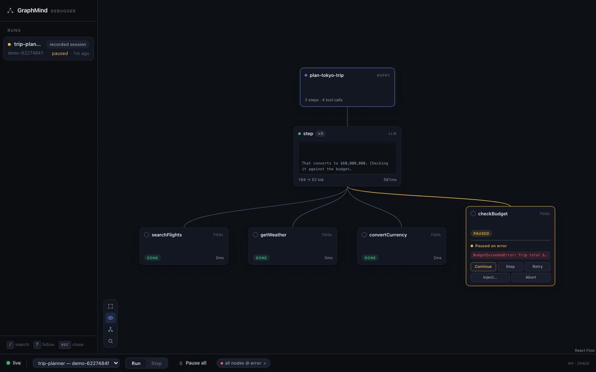
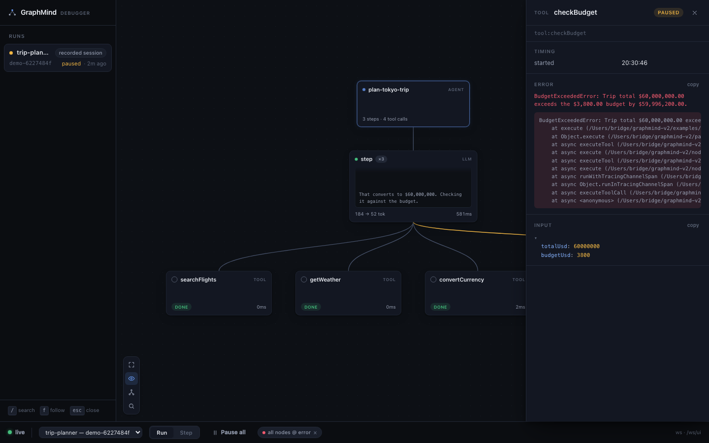

# GraphMind

**The live debugger for AI agents.**

Phoenix and Langfuse show you what your agent did. GraphMind attaches while
it's happening: watch the execution graph light up live, pause on error, set
breakpoints, step call by call, inspect every input and output — then inject a
fix and resume the run.



The pause is real. When a gate holds, nothing is in flight — the model call or
tool `execute` has not started yet — so you can hold a run for as long as you
need, change what a tool returns, and let the agent continue down a different
path. And it fails open: with no debugger attached the instrumentation is a
no-op, and if the debugger disconnects mid-hold, every held gate auto-continues.

- **Local-first** — one command, no account. The server binds `127.0.0.1`
  only; runs are stored in a local SQLite file. Your prompts and payloads
  never leave your machine.
- **Live attach, not post-hoc** — pause-on-error is armed by default;
  breakpoints, step mode, inject / retry / continue / abort.
- **The graph is a projection of your code** — GraphMind never authors your
  workflow, it reveals it. One node per logical code location; executions
  light it up.
- **MIT licensed.**

Requires Node >= 22.13 (SQLite is built in — zero native dependencies).

## Quick start

### 1. Try it in one command (no API key)

```sh
npx graphmind-ai demo
```

This opens the viewer and replays a recorded debug session of a trip-planner
agent with a planted bug — `convertCurrency` inverts the exchange rate, so a
¥402,000 trip becomes $60,000,000 and the budget check throws. The replay
goes through the real ingest pipeline and honors the real control protocol:
the error genuinely pauses the run, and from the viewer you can **inject** a
corrected result (the agent finishes happily), **continue** (it apologizes),
**retry**, or **abort**.

### 2. Debug your own agent (Vercel AI SDK)

Start the debugger:

```sh
npx graphmind-ai
```

Instrument your app — wrap the model and tools, nothing else changes:

```ts
import { graphmind } from '@graphmind-ai/sdk';

const gm = graphmind({ app: 'support-agent' });
await gm.ready(); // optional: wait for the debugger to attach (fails open on timeout)

const model = gm.wrapModel(anthropic('claude-sonnet-4-5'));
const tools = gm.wrapTools({ searchFlights, checkBudget });

await gm.run('handle-ticket', () => streamText({ model, tools, prompt }).consumeStream());
```

Built only on public AI SDK extension points (`wrapLanguageModel` middleware +
tool-`execute` decoration) — no fork, no monkey-patching. See
[`packages/ai-sdk`](./packages/ai-sdk/README.md) for the full adapter contract
(gates, fail-open guarantees, streaming and provider-executed tools, timeout
neutralization).

> The adapter currently lives in this repo under the workspace name
> `@graphmind-ai/sdk`; its public npm name is being finalized for the first
> release.

### 3. Import traces from any other framework

```sh
npx graphmind-ai import trace.json
```

Loads an OpenTelemetry (OTLP/JSON) or OpenInference span export — LangChain,
LangGraph, CrewAI, or anything else that emits OTel GenAI / AI SDK /
OpenInference spans — as a run you can browse in the viewer. Best-effort and
clearly labeled: imported runs are history only, with no live features.

## What you get

- **Live execution graph** — agents, LLM steps, and tool calls render as one
  graph while the run executes, with streamed token previews on the active
  node. Parallel tool calls gate independently.
- **Pause on error, by default** — a fresh server arms an error breakpoint;
  the run freezes at the throw *before* your framework sees the error.
- **Breakpoints and step mode** — match on node kind, name, or gate point
  (`before` / `after` / `error`); step mode pauses at every gate. "Pause all"
  is one click.
- **Inject-and-continue** — edit a tool's result as JSON at a pause and
  resume; also retry the call, continue with the original error, or abort the
  run (cooperative cancellation via `AbortSignal`, so SDK retry logic doesn't
  fight you).
- **Every run is kept** — history persists in SQLite; reopen any past run and
  inspect each node's inputs, outputs, errors, timings, and token usage.
  Export any run to a replayable NDJSON fixture with `graphmind record`.
- **MCP for coding agents** — `graphmind mcp` serves your runs to Claude
  Code or Cursor over stdio (read-only: list runs, inspect nodes, find recent
  errors, deep-link into the viewer).
- **Local-first** — `127.0.0.1` only, no auth, no account, no cloud. SQLite
  via `node:sqlite`, so there are no native dependencies to compile.
- **Fail-open everywhere** — detached instrumentation short-circuits (the
  test suite asserts sub-millisecond gate overhead); the adapter never throws
  into your app; `NODE_ENV=production` disables it unless you opt in with
  `GRAPHMIND=1`, and `GRAPHMIND_DISABLED=1` always wins.



## Use it from Claude Code or Cursor

```sh
claude mcp add graphmind -- npx graphmind-ai mcp
```

Your coding agent can then answer "why did my last run fail?" from the actual
recorded execution — recent errors, per-node inputs/outputs, timings, token
usage — with deep links into the viewer. It reads the local database directly,
so it works even while the viewer is closed.

## How it compares

Langfuse, Arize Phoenix, LangSmith, and `@ai-sdk/devtools` are observability
tools: they collect traces and show you what happened after the fact. They are
good at that, and GraphMind is not trying to replace them — it imports the
same OTel/OpenInference trace formats they speak. The difference is the
debugger part: GraphMind holds a live connection to your running process, so
it can stop execution at a gate, let you change a value, and resume — the
workflow you already know from stepping through code, applied to agents.

GraphMind is **not**:

- an eval or prompt-management platform — no datasets, scores, or A/B tests
- a visual agent builder — it never generates or owns your workflow code
- a hosted service — there is no cloud, no dashboard login, no data retention
  to think about

## Telemetry

The CLI sends one anonymous event per command invocation (command name,
random install id, version — never args, prompts, traces, or run data), and
`GRAPHMIND_TELEMETRY=0` turns it off entirely. Full disclosure, including the
exact JSON record: [packages/cli/TELEMETRY.md](./packages/cli/TELEMETRY.md).

## Repository layout

| Path | What it is |
|---|---|
| [`packages/schema`](./packages/schema) | Versioned wire contract (Zod + JSON Schema export) — the envelope/event/control protocol |
| [`packages/client`](./packages/client) | SDK-agnostic runtime: transport, ring-buffer replay, the gate engine, fail-open logic |
| [`packages/ai-sdk`](./packages/ai-sdk) | Vercel AI SDK adapter (model middleware + tool wrapping) |
| [`packages/cli`](./packages/cli) | `graphmind-ai` (bin `graphmind`): local server, SQLite storage, demo, trace importer, MCP server, viewer host |
| [`apps/viewer`](./apps/viewer) | The graph debugger UI (ships built inside the CLI package) |
| [`apps/web`](./apps/web) | graphmind.ai |
| [`examples/demo-agent`](./examples/demo-agent) | The planted-bug trip-planner demo agent |
| [`examples/e2e`](./examples/e2e) | Full-stack smoke test against a running server |

## Contributing

The most useful contribution right now is an adapter for a framework you use.
Adapters target the versioned wire contract in
[`packages/schema`](./packages/schema/README.md) — Zod schemas with a JSON
Schema export for other languages, semver-governed, with a version-negotiating
parser. If a full live adapter is too much, a converter for your framework's
trace export into the importer
([`packages/cli/src/import`](./packages/cli/src/import/README.md)) gets you
post-hoc graphs immediately.

Issues and PRs welcome. Keep it small and honest — this is a solo project.

## License

[MIT](./LICENSE)
